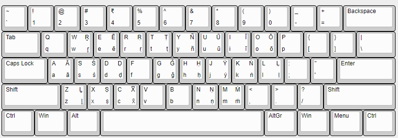

# iast-keyboard

This is a personal project of mine to implement an Indic keyboard layout which could be used in the Indian subcontinent (India, Bangladesh, Sri Lanka, Nepal, Bhutan, Pakistan, and Afghanistan) as the standard keyboard layout that would facilitate typing in Indic languages transliterated into the modified latin script following the IAST (International Alphabet for Sanskrit Transliteration) standard for the majority of the languages.

## Layout

| IAST  | Keyboard  | Devanāgari / Kal̥ingalipi Equivalent | Unicode (Devanāgari) |
|:---:|:---:|:---:|:---:|
|ā |AltGr + a|  आ / ଆ   | U+0101      |
|ī |AltGr + i|   ई / ଈ   |   U+012B    |
|ū |AltGr + u|   ऊ / ଊ   |   U+016B    |
|ō |AltGr + o|   ओऽ   |   U+014D    |
|ē |AltGr + m|   एऽ   |   U+0113    |
|r̥ |AltGr + r|   ड़ / ଡ଼   |   U+1E5B    |
|ś |AltGr + s|   श / ଶ   |   U+015B     |
|ḍ |AltGr + d|   ड / ଡ   |    U+1E0D   |
|ṅ |AltGr + g|    ङ / ଙ  |   U+1E45    |
|ḥ |AltGr + h|   अः / ଃ   |   U+1E25    |
|l̥ |AltGr + l|   ळ / ଳ  |   U+1E37    | 
|ñ |AltGr + y|   ञ / ଞ  |   U+00F1    |
|ṁ |AltGr + m|   म् / ଂ   |    U+1E41   |
|ṇ |AltGr + n|   ण / ଣ   |  U+1E47     |
|ṣ |AltGr + x|   ष / ଷ  |   U+1E62    |
|ṭ |AltGr + t|   ट / ଟ   |   U+1E6D    |
|ẏ |    | ଯ |   U+1E8F|

1. Example 1:
   + Here's a sentence in Hindi:
      + सभी मनुष्यों को गौरव और अधिकारों के मामले में जन्मजात स्वतंत्रता और समानता प्राप्त है । उन्हें बुद्धि और अंतरात्मा की देन प्राप्त है और परस्पर उन्हें भाईचारे के भाव से बर्ताव करना चाहिए । 
   + Here's the transliteraion in IAST which the mentioned keyboard layout would support:
     + Sabhī manuṣyōṁ kō gaurav aur adhikārōṁ kē māmalē mēṁ janmajāt svatantratā aur samānatā prāpt hai. Unhēṁ buddhi aur antarātmā kī dēn prāpt hai aur paraspar unhēṁ bhāīcārē ke bhāv sē bartāv karanā cāhiē.
2. Example 2:
   + Here's a sentence in Odia:
     + ସାବୁ ମନୁଷ୍ୟ ଜନ୍ମକାଳରୁ ସ୍ବାଧୀନ, ସେମାନଙ୍କର ମର୍ଯଦା ଓ ଅଧିକାର ସମାନ, ସେମାନଙ୍କଠାରେ ପ୍ରଞା ଓ ବିବେକ ନିହିତ ଅଛି, ସେମାନେ ପରସ୍ପର ପ୍ରତି ଭ୍ରାତୃଭାବ ପୋଷଣ କରି କାର୍ଯ୍ଯ କରିବା ଦରକାର ।
   + Here's the transliteraion in IAST which the mentioned keyboard layout would support:
     + Sabu manuṣẏa janmaukāḷaru svādhīna, ṣemānaṅkara marẏadā o adhikāra samāna, semānaṅkaṭhāre prajñā o bibeka nihita achi, semāne paraspara prati bhrātrubhāba poṣaṇa kari kārẏya karibā darakāra.

## Modifiers

1. On **macOS**: Alt or Options key
2. On **Windows** / **Ubuntu based distros**: Right Alt or AltGr key

## PostScript

Support for the remaining Indic languages will be added (along with the examples for usage) with enough support.